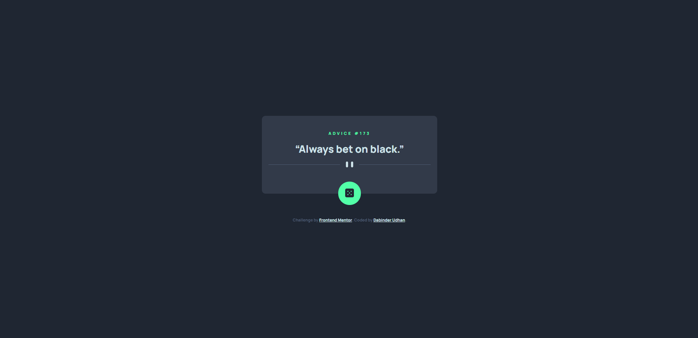

# Frontend Mentor - Advice generator app solution

This is a solution to the [Advice generator app challenge on Frontend Mentor](https://www.frontendmentor.io/challenges/advice-generator-app-QdUG-13db). Frontend Mentor challenges help you improve your coding skills by building realistic projects.

## Table of contents

- [Overview](#overview)
  - [The challenge](#the-challenge)
  - [Screenshot](#screenshot)
  - [Links](#links)
- [My process](#my-process)
  - [Built with](#built-with)
  - [What I learned](#what-i-learned)
- [Author](#author)

## Overview

### The challenge

Users should be able to:

- View the optimal layout for the app depending on their device's screen size
- See hover states for all interactive elements on the page
- Generate a new piece of advice by clicking the dice icon

### Screenshot

### Links

- Solution URL: [Github URL](https://github.com/dabinderudhan/Advice-generator-app)
- Live Site URL: [live site URL](https://dabinderudhan.github.io/Advice-generator-app/)

## My process

### Built with

- Semantic HTML5 markup
- CSS custom properties
- Flexbox
- Mobile-first workflow
- Vanilla JavaScript
- Fetch API using async await

### What I learned

Using fetch with async and await, we can add the content of the API into our DOM dynamically.

## Author

- Website - [Github profile](https://github.com/dabinderudhan)
- Frontend Mentor - [@dabinderudhan](https://www.frontendmentor.io/profile/dabinderudhan)
- Twitter - [@dabinderudhan](https://twitter.com/dabinderudhan)
